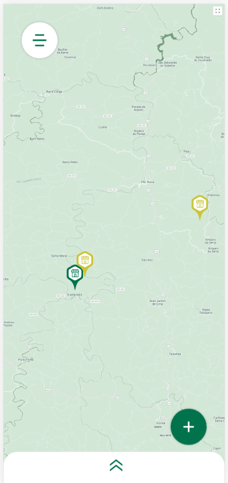
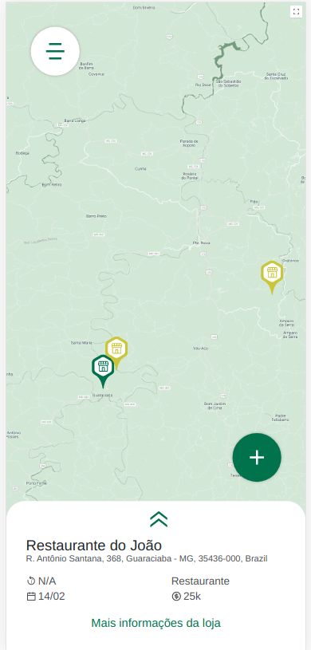
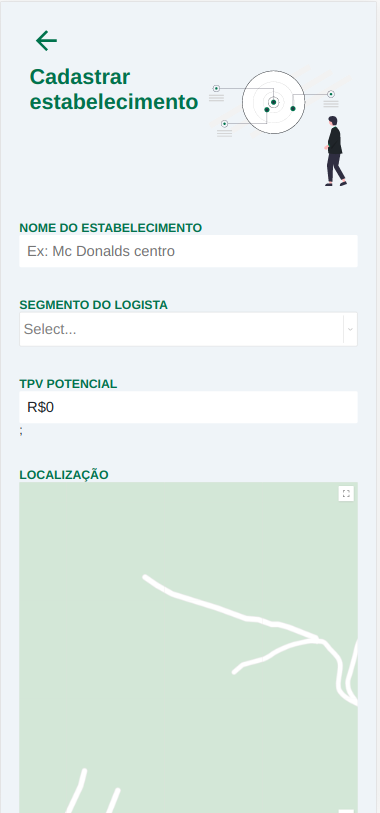
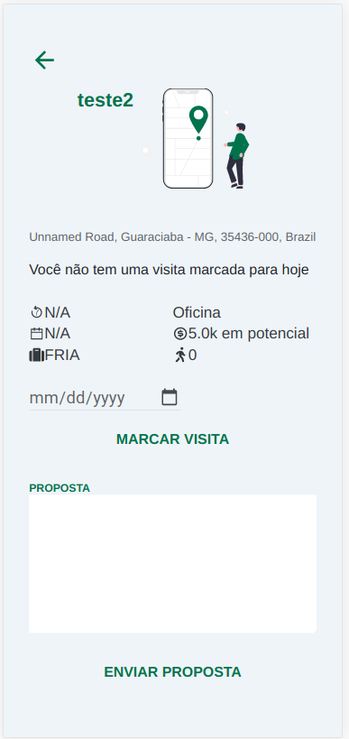
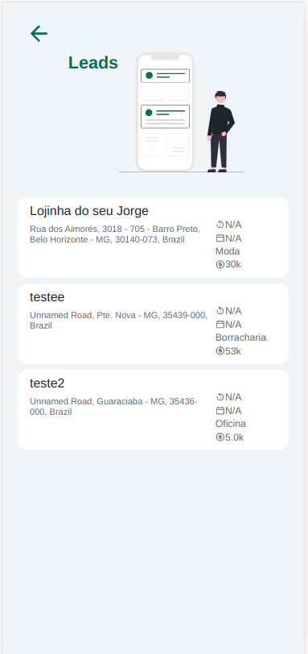

# Stone Challenger

> Essa aplicação foi desenvolvida como requisito do processo seletivo da Stone Pagamentos
---
## Como instalar

Basta entrar no diretório do projeto e instalar os pacotes com o yarn ou npm

yarn
```sh
yarn
```

npm
```sh
npm -i
```

---

## Como usar

> **Atenção:** é necessário que o backend esteja rodando corretamente

Para iniciar o projeto rode
yarn
```sh
yarn start
```

npm
```sh
npm run start
```

## Screenshots

      


Desenvolvido por João Victor Cabral
